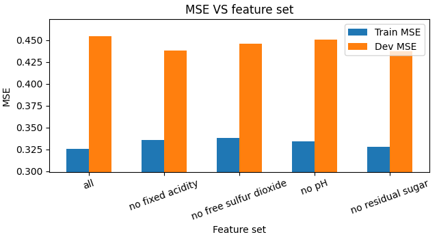
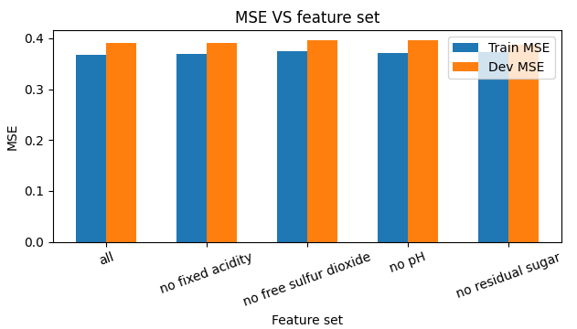
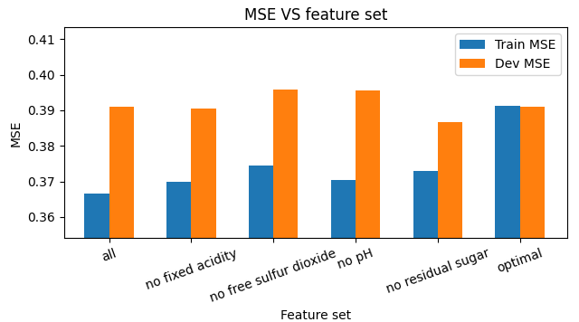
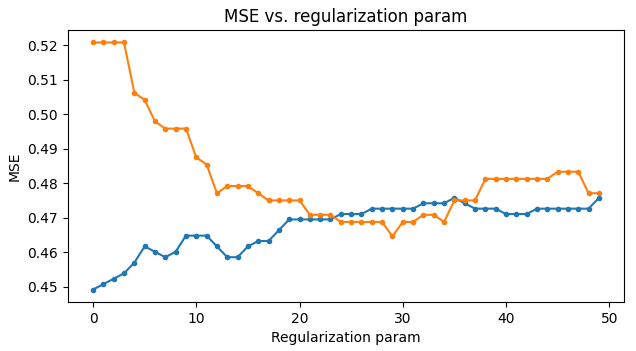
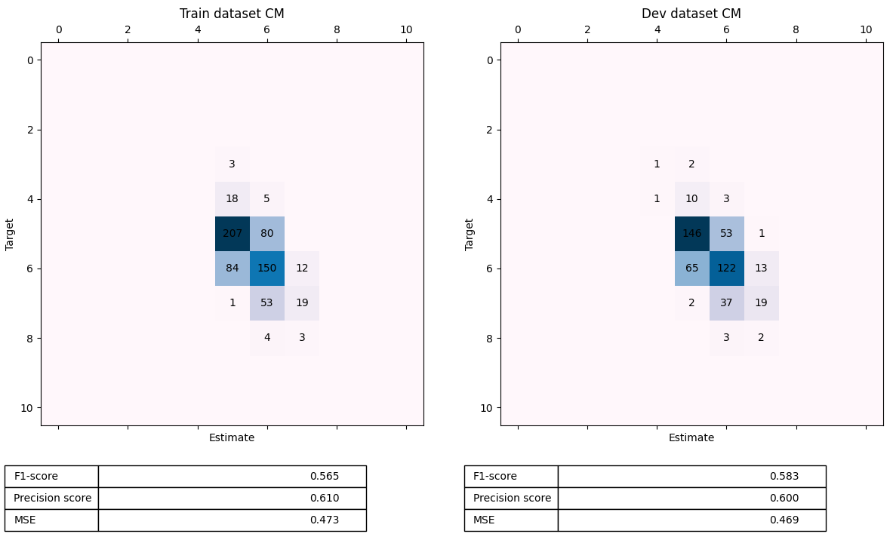
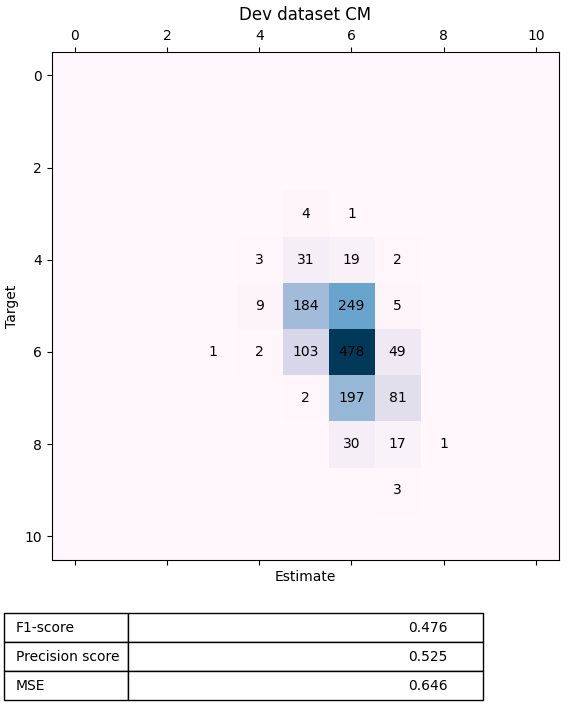

# Goal

Train models of white and red wine quality using _scikit learn_ and _Tensorflow_. Compare the following algorithms:

- Polynomial Regression
- Softmax Regression
- Dense Neural Network (hereinafter: DNN)

Try transfer learning to improve red wine model based on white wine model.

# Data analysis

## Dataset overview

White whine:

```text
RangeIndex: 4898 entries, 0 to 4897
Data columns (total 12 columns):
 #   Column                Non-Null Count  Dtype  
---  ------                --------------  -----  
 0   fixed acidity         4898 non-null   float64
 1   volatile acidity      4898 non-null   float64
 2   citric acid           4898 non-null   float64
 3   residual sugar        4898 non-null   float64
 4   chlorides             4898 non-null   float64
 5   free sulfur dioxide   4898 non-null   float64
 6   total sulfur dioxide  4898 non-null   float64
 7   density               4898 non-null   float64
 8   pH                    4898 non-null   float64
 9   sulphates             4898 non-null   float64
 10  alcohol               4898 non-null   float64
 11  quality               4898 non-null   int64  
dtypes: float64(11), int64(1)
```


Red whine:

```text
RangeIndex: 1599 entries, 0 to 1598
Data columns (total 12 columns):
 #   Column                Non-Null Count  Dtype  
---  ------                --------------  -----  
 0   fixed acidity         1599 non-null   float64
 1   volatile acidity      1599 non-null   float64
 2   citric acid           1599 non-null   float64
 3   residual sugar        1599 non-null   float64
 4   chlorides             1599 non-null   float64
 5   free sulfur dioxide   1599 non-null   float64
 6   total sulfur dioxide  1599 non-null   float64
 7   density               1599 non-null   float64
 8   pH                    1599 non-null   float64
 9   sulphates             1599 non-null   float64
 10  alcohol               1599 non-null   float64
 11  quality               1599 non-null   int64  
dtypes: float64(11), int64(1)
```


Notes:

- Both tables have the same columns, therefore models for white and red wine are very likely to perform well on the same
  set of input features. Therefore, we can improve red whine model using **transfer learning** from white wine model,
  since it has much more examples. We could also create a more complex model that evaluates quality for both types of
  wine, but it is pointless.
- All the data is numerical which is very convenient because we **don't have to encode categories**, and we are less
  likely to have extra bias because of outlier categories.
- Dataset is not balanced, and some classes are even missing. This will hurt performance of our models very much and
  will make them harder to compare. Unfortunately, we can't collect or engineer more data. Therefore, in order to
  compare models we will also consider precision on classes missing in the training set. We might want to add a more
  bias to models, in order to make them generalize better on unknown data.

## Correlation matrix

White wine:


Red wine:


Notes:

- Some input variables correlate with each other. They can cause troubles as well as improve performance. We should try
  **throwing them away**. Namely: residual sugar (white wine); free sulfur dioxide (white wine); fixed acidity (red
  wine); free sulfur dioxide (red wine); pH (red wine).
- Some input variables have very weak correlation with quality. They don't contribute to better results and are more
  likely to cause high variance. We should **try to throw them away**. Namely: citric acid (white wine); residual
  sugar (white wine); free sulfur dioxide (white wine); pH (white wine); sulphates (white wine); residual sugar (red
  wine); free sulfur dioxide (red wine); pH (red wine).

# Plan

1. Train polynomial regression model for white wine
2. Train softmax regression model for white wine
3. Compare polynomial and softmax models
4. Train a DNN for white wine
5. Compare DNN with regression of choice (neural network must win this time)
6. Train a DNN for red wine
7. Train another DNN for red wine using transfer learning
8. Compare DNNs for red wine

Comparison will be based on performance on known categories and unknown categories. We will reserve 9th grade white wine
for testing models on unknown data. They will not be used for training.
The output layers for DNNs will be chosen based on which of the regression algorithms won. If it was softmax, then we'll
use softmax, and if polynomial - we'll use ReLU.

## 1. Polynomial regression for white wine


Degree greater than 2 causes both huge feature number and huge variance, so we'll definitely not use it. Let's zoom in
and compare 1st and 2nd degree polynomials.


```text
Function: compare_poly_degrees
```

Feature number is totally fine in both cases. MSE on dev dataset is practically the same for 1 and 2 degree polynomials.
There may be a little overfitting with the second degree, but we cannot improve it drastically, so let's use second
degree polynomial without regularization.

Next, let's try to get rid of features that highly correlate with others or almost don't correlate with quality.


From the plot we can conclude:

- **keep residual sugar**. Throwing it away increased bias even though it's correlation with quality is 0.01. Seems that
  this parameter in combination with some other parameter gives better estimates.
- **drop free sulfur dioxide**. It will decrease variance.
- **drop citric acid**. It doesn't do anything, and it's better to keep the model simple.
- **keep pH**. It slightly decreases bias.
- **drop sulphates**. It doesn't do anything, and it's better to keep the model simple.

Let's double-check our conclusions:


```text
Function: compare_feature_sets
```

Perfect. There was a tiny chance that residual sugar had synergy with free sulfur dioxide or citric acid, but throwing
them away didn't do anything bad.

Now, let's test the performance of our model.


```text
Function: train_polynomial_regression
```

Model evaluates wine quality with precision of 54.0%, which could be considered a good result given that MSE is only
0.58, which means that the error is not greater than one grade in most cases. But the model generalizes poorly for
wine of low and high quality, so we can and should do better.

From the confusion matrix we can see that evaluations have a bias towards grades 5 and 6. And overall performance on the
training and the dev set is practically the same. Therefore, we're dealing with the problem of a **high bias**.

High bias implies that our model can't determine the correlation between input and target values well. In order to
improve it, we have to increase the number of features. We can't get more relevant data on wine characteristics, so the
only way to add features is to add more polynomials or fancy functions. We can't automatically pour any more polynomials
in our model because it will have more parameters than the data, which leads to extreme overfitting. Engineering new
features manually requires a lot of time and consulting with wine experts. So, in order to improve performance
significantly, we have to **choose another model**. Let's move on to next one.

## 2. Training softmax regression

Softmax regression is not much more complex than polynomial regression, but it's a classification algorithm, which could
perform better classifying wine. The downside is that it doesn't take advantage from the linearity of classes. It's hard
to tell, but we can assume that softmax regression will distinguish adjacent qualities better. On the other hand, it
will sometimes give more random results.

Features for softmax regression are likely to be the same as for polynomial regression, so let's skip this step and
build the model immediately.


F1 and precision scores tell us about slight overfitting, so let's specify regularization parameter to 1, which is the
default value.


```text
Function: train_logistic_regression
```

As we expected, softmax regression performed a little better at distinguishing adjacent categories and gave little more
random results. But the problem with **high bias remains**.

## 3. Polynomial regression vs. softmax regression

| Model                 | F1-score | Precision score |
|-----------------------|----------|-----------------|
| Polynomial regression | 0.491    | 0.540           |
| Softmax regression    | 0.508    | 0.568           |

Softmax regression has better F1-score and precision score. But it also made more random results. Seems like it makes
fewer mistakes, but the mistakes are bigger. Our metrics don't display this, so let's introduce decision MSE. Polynomial
regression must have less MSE, because this is exactly the function it minimizes.

For polynomial regression it is:


For softmax regression it is:


Indeed, polynomial regression outperformed softmax regression in this one even without regularization, and for wine
quality evaluation this is more important than precision. If algorithm makes a mistake between 5 and 6, it's not as bad
as a mistake between 5 and 7. Softmax regression ignores this fact in favor of precision. For this reason we will
**choose polynomial regression** over softmax regression.

## 4. DNN for white wine

Neural network is a low-bias machine, so it must vastly improve predictions. It will use the same features as before.
We will choose between the following configurations:

**C1**

1. Input; 44 units
2. Dense; 88 units; ReLU
3. Dense; 352 units; ReLU
4. Dense; 1 units; ReLU

**C2**

1. Input; 44 units
2. Dense; 352 units; ReLU
3. Dense; 88 units; ReLU
4. Dense; 1 unit; ReLU

**C3**

1. Input; 44 units
2. Dense; 88 units; ReLU
3. Dense; 44 units; ReLU
4. Dense; 88 units; ReLU
5. Dense; 1 unit; ReLU

**C4**

1. Input; 44 units
2. Dense; 176 units; ReLU
3. Dense; 176 units; ReLU
4. Dense; 1 unit; ReLU

Training results:


_Note: MSE is calculated on rounded results, so it's comparable with classification algorithms._

It's an obvious overfitting. C1 model seems to fit the training set better than others. We can assume that after
applying L2 regularization, it will perform better on the dev test too. But let's check this assumption.


```text
Function: compare_neural_networks
```

Models perform pretty much the same for any regularization param. Picking sufficient regularization param (0.01) causes
the same high bias problem we had with our regressions. If it is lower, we get high variance problem. Let's choose C1
and investigate it. First, we'll double-check that we've chosen a correct regularization param.


```text
Function: plot_mse_vs_reg_param
```

From this plot we confirm that regularization params between 0.005 and 0.01 are reasonable. Now, let's plot the
learning curve.


Learning curves converge and flatten out as we add more training examples, so adding even more examples won't change
anything. Classical high bias.

We have the following options how to lower the bias:

1. Collect or engineer more features.
2. Make model more complex to fit existing features better.

First option is not really an option because we don't have a customer that could provide more relevant data, and it's
impossible to engineer features since nobody knows how exactly physicochemical properties of wine are related to taste.

Adding more layers and neurons has practically the same effect as lowering regularization param, because with low
regularization param our model fits training set well, i.e. it is complex enough to fit the data. And we saw that
lowering regularization leads to high variance.

We cannot set low regularization and then fix high variance problem by adding more data either. It is clear if we
plot MSE against training set size:


```text
Function: plot_mse_vs_train_data_size
```

_Note: MSE leap in the beginning happened because Z was below 0 in the output layer. ReLU derivative is 0 for Z < 0,
therefore gradient was 0 for every param. This event is random and caused by initial params given by Tensorflow. It is
not a problem, I just randomly found it and wanted to show._

Dev MSE curve decreases much slower than train MSE curve. It's very likely that if we continue to enlarge training set
these curves will converge somewhere around 0.6, which is almost the same accuracy we had before.

Thus, we conclude that in order to noticeably improve white wine quality estimates, **we need to know more about
properties of wine** to evaluate.

Tests:


```text
Function: train_neural_network
```

## 5. DNN vs. polynomial regression

| Model                 | F1-score | Precision score | Mean squared error |
|-----------------------|----------|-----------------|--------------------|
| Polynomial regression | 0.491    | 0.540           | 0.648              |
| Dense neural network  | 0.511    | 0.550           | 0.637              |

DNN performed better than polynomial regression by all parameters, but the difference is very small, in contrast with
much greater complexity of the DNN. On the other hand, behaviour of polynomial regression is much easier to interpret.
Therefore, we are going to **choose polynomial regression**.

## 6. Polynomial regression for red wine

We'll use polynomial degree of 2 as we did for white wine. But the feature selection should be performed again.



Seems like all the features we found are redundant, but high variance could distort results, so let's use Ridge
regression with polynomial features instead, which is basically the Polynomial regression with normalization. I've
played with regularization param and found value of 30 performing pretty good.



All of these features seem to not contribute to the result, so let's **drop all of them** for the sake of simplicity.

Double-check:



```text
Function: compare_feature_sets_red
```

Now, the variance is non-existent! Actually, the train MSE is even greater than the dev MSE, so we're rather lucky to
get such low variance. However, at this point it makes sense to try lower regularization params.



```text
Function: plot_mse_vs_reg_param_red
```

Regularization param of 28 must be a bit better. Now, it's time to test the model.



```text
Function: train_polynomial_regression_red
```

Still, the model has a bias towards 5 and 6 grades, but that's because the data is unbalanced and model can't find a
sufficient relation between properties of wine and its quality.

We could try to build a DNN for red wine as well, but it's likely that red wine does not have a decent link between the
properties we have and quality, just as the white wine does.

Also, it doesn't make sense to apply transfer learning. Using transfer learning is similar to adding more training
examples. It could only help with high variance, but the variance of red wine model is excellent.

# Final test

White wine model:



Red wine polynomial model:


# Conclusion

We've developed polynomial regression, softmax regression and dense neural network models for white wine. Softmax
regression appeared to be more precise than polynomial regression, but MSE of polynomial regression was lower, which is
more important in terms of evaluating quality. Neural network had the best precision and MSE, but its results are
much harder to interpret, so we ended up choosing polynomial regression for classifying white wine quality. It has
precision of 0.525 and error of 0.646. In simple terms these characteristics mean that model evaluates wine quality
correctly in 52.5% cases, and if a mistake happens, it is only 1 grade in most cases.

Also, we've trained a polynomial regression model for red wine. It has precision of 0.634 and MSE of 0.479. In simple
terms these characteristics mean that model evaluates wine quality correctly in 63.4% cases, and if a mistake happens,
it is only 1 grade in most cases.

**The models we've trained can help us determine how physio-chemical properties of white and red wine affect quality,
and thus, optimize wine production**. It's still possible to make these models more precise. To do this, we need more
information on properties of wine and more examples of low and high quality wine.

_Note: collecting more training examples of low and high quality wine would help us determine link between properties
and quality of wine and also would help predicting quality of low and high quality wine. But, the precision and MSE
would become worse._

Also, we could slightly improve performance using other machine learning algorithms, such as multiple regression and
support vector regression, but this is out of our scope. We've accomplished all the goals of this project, except using
transfer learning. Transfer learning appeared to be needless, because red wine model under-fits data.

Want to mention that I've made a lot of assumptions that DNN would perform significantly better than regressions, but I
was wrong. These assumptions were made based on another assumption that data is highly correlated with wine quality,
which appeared to be not the case. Estimates will always have an error if there's a random component in predictions, no
matter how complicated algorithm is. And the correlation appeared to be simple enough for regression models, so using a
NN is excessive.
